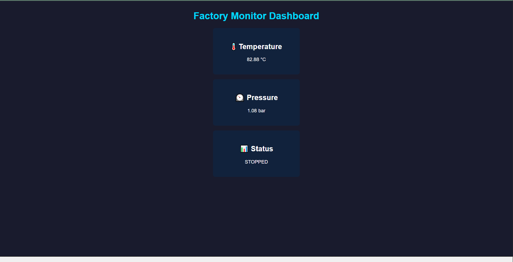

# 🏭 Factory Monitor Dashboard

A real-time industrial IoT monitoring system built with Python, MQTT, Flask, and SQLite.

## 📸 Dashboard Preview


## 🔧 How It Works

```
Publisher → MQTT Broker → Subscriber → SQLite Database → Flask API → Live Dashboard
```

## ⚙️ Tech Stack
- Python
- MQTT (HiveMQ public broker)
- Flask (REST API)
- SQLite (database)
- HTML / CSS / JavaScript (frontend)

## 🚀 How To Run

Install dependencies:
```
pip install flask paho-mqtt
```

Terminal 1 — Start Flask:
```
python app.py
```

Terminal 2 — Start Subscriber:
```
python subscriber.py
```

Terminal 3 — Start Publisher:
```
python publisher.py
```

Open browser:
```
http://127.0.0.1:5000/dashboard
```

## 📊 Features
- Live temperature monitoring (°C)
- Live pressure monitoring (bar)
- Machine status — RUNNING / STOPPED
- Auto updates every 3 seconds
- All readings saved to SQLite database with timestamp
- REST API endpoints: /api/readings and /api/latest

## 👨‍💻 Author
Mihir Patil
[LinkedIn](https://linkedin.com/in/mihirpatil03) | [GitHub](https://github.com/mihirpatil37)


